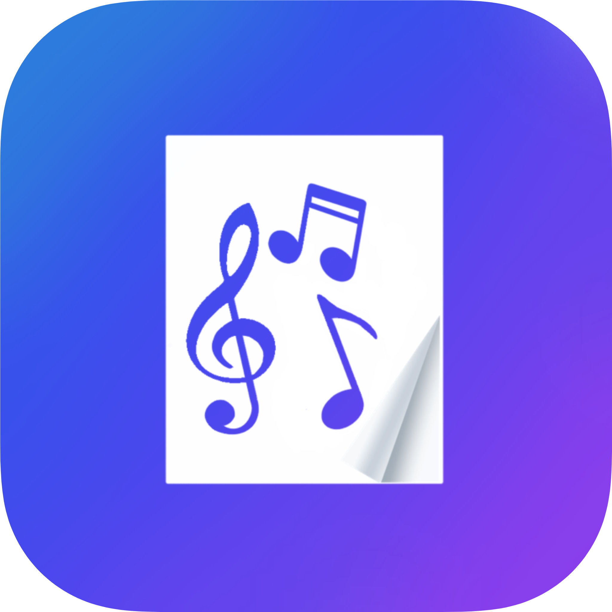

# Flip Pages
> The purpose of this project is to develop an app capable of turning the pages of a musician’s score subtly. The automatic page turner will allow the user to practice his/her music without being distracted by manually flipping the page. The team’s primary focus is on constructing an easy-to-use app that consistently turns the page at the appropriate time. 

  

## Table of Contents
* [General Info](#general-information)
* [Technologies Used](#technologies-used)
* [Features](#features)
* [Screenshots](#screenshots)
* [Setup](#setup)
* [Usage](#usage)
* [Project Status](#project-status)
* [Room for Improvement](#room-for-improvement)
* [Acknowledgements](#acknowledgements)
* [Contact](#contact)
<!-- * [License](#license) -->

## General Information
- Traditionally, sheet music is in the form of a multi-page document. When a musician reaches the final bar of a page, they need to either stop playing and turn to the next page or depend on someone else to turn the page for them when appropriate. Both methods can be very distracting; Such a distraction can make practice as well as performance more difficult due to the possible break in musical continuity or concentration. Dr. Samson Cheung who has picked up the piano after 30 years says that turning the pages is “Highly distractive” for musicians. A system is needed to mitigate a musician’s distraction of turning the pages of a musical score. The app will be designed with beginners in mind as expert musicians may not use sheet music.
- The objective of this project is to design an automatic page turner to help musicians turn the page of their scores while they are playing while minimizing the distraction to the musician. During the time playing the musical instruments, turning pages is either to have the musician turning it by hand or foot pedal or an assistant doing the page turning. The goal of our project is to use an interface that relies on the front camera of the device to detect specific page turning gestures such as head turning or eye gaze. We will also focus on developing an app for the phone or tablet with some specific software during the process to improve the accuracy, reliability, and security of the design. 
- For centuries, paper sheet music has been the primary way musicians have been able to learn and perform songs. Typically, musicians will turn the pages of the sheet music by hand or have a separate person doing the page-turning. However, this approach to turning sheet music pages can be a cause of distraction for musicians.

<!-- You don't have to answer all the questions - just the ones relevant to your project. -->

## Technologies Used
- [Flutter SDK](https://flutter.dev/) - version 2.5.3
- [get](https://pub.dev/packages/get) - version 4.6.1
- [file_picker](https://pub.dev/packages/file_picker) - version 4.3.3
- [flutter_pdfview](https://pub.dev/packages/flutter_pdfview) - version 1.2.1
- [path](https://pub.dev/packages/path) - version 1.8.0
- [permission_handler](https://pub.dev/packages/permission_handler) - version 8.3.0
- [flutter_cached_pdfview](https://pub.dev/packages/flutter_cached_pdfview) - version 0.4.1
- [path_provider_ex](https://pub.dev/packages/path_provider_ex) - version 1.0.1
- [flutter_file_manager](https://pub.dev/packages/flutter_file_manager) - version 0.2.0
- [camera](https://pub.dev/packages/camera) - version 0.9.4+11
- [google_ml_kit](https://pub.dev/packages/google_ml_kit) - version 0.7.2

## Features
The current build of Flip Pages allows users to turn pages of musical scores by tilting their head to the right.

## Screenshots

  
  
  

## Setup
To use this project you will need to [install Flutter](https://docs.flutter.dev/get-started/install). For running on iOS you will also need to [install Xcode](https://apps.apple.com/us/app/xcode/id497799835?mt=12). Once you have downloaded the project, you will need to run `flutter pub get`. For iOS, you will also need to run `pod install` within the ios directory in Terminal and follow the [steps to deploy an iOS Flutter app](https://docs.flutter.dev/deployment/ios).

## Usage
To add a new PDF to the music library the following steps need to be done, where <em>pdf_name</em> is the name of the PDF file.
- Add your PDF to the asssets folder
- Within the pubspec.yaml file add the following to the assets section: `- assets/pdf_name`
- In the loadFiles() function in files_controller.dart add the following line: `filePaths.add('assets/pdf_name');`

## Project Status
This project is currently in progress.

## Room for Improvement
If we had more time to work on this project, we hoped to be able to add audio processing as a method to turn pages. This is something that we had been working on, but couldn't get implemented within the application before the deadline. The links below will take you to other repositories containing the code we have done for audio processing:
- [Image proccessing](https://github.com/cjmo253/Capstone_Score_Processing/tree/master) for musical scores that provides a MIDI file of the detected noted.
- Audio Procedding

## Acknowledgements
- This idea for this project was provided by our sponsors Dr. Samson Cheung and Dr. Mike Johnson.

## Contact
Created by:
- [Logan Bannister](https://github.com/loganbannister)
- [Ryan Bezold](https://github.com/Hydraux)
- [Cooper Moore](https://github.com/cjmo253)
- [Tony Ramirez](https://github.com/tonypacheco223)
- [Feng Ye](https://github.com/plantduck)

<!-- Optional -->
<!-- ## License -->
<!-- This project is open source and available under the [... License](). -->

<!-- You don't have to include all sections - just the one's relevant to your project -->
